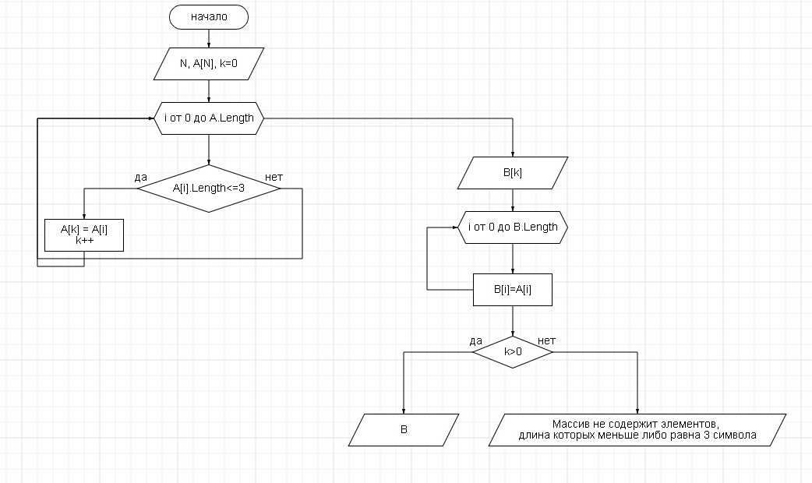

# Условие задачи #
### Написать программу, которая из имеющегося массива строк формирует массив из строк, длина которых меньше либо равна 3 символа. Первоначальный массив можно ввести с клавиатуры, либо задать на старте выполнения алгоритма. При решение не рекомендуется пользоваться коллекциями, лучше обойтись исключительно массивами.
Описание алгоритма решения задачи

1. Сначала вводим количество элементов массива строк N:
2. Вводим элементы массива строк A[N]
3. Опрделяем отдельно в виде функции печать массива
4. В цикле от 0 до N-1 проверяем все элементы массива строк A[] на выполнения условия задачи (A[i]<= 3)
5. Если выполняется условие, тогда перезаписываем массив строк A и увеличиваем счетчик k
6. Вводим массив строк B с размерностью k
7. Все элементы массива строк A, удовлетворяющие условию задачи, переписываем в массив B
8. Печать массива строк B

На рисунке представлена блок-схема решения задачи

